[toc]

# CS205-2022Fall Project 4

## Optimizing Matrix Multiplication

**Name:** 陈康睿

**SID:** 12110524

## Part 1 - Analysis & Implementation

In this project, I try to use localization, SIMD, Multithreading, Memory alignment and compile options to accelerate matrix multiplication. I also tried Stressen algorithm.

To simplify and concentrate on optimization, I only implemented functions supporting square matrices. (For Stressen algorithm, square matrices with order $$2^n$$ especially)


### Libraries

```c
#include <stddef.h>
#include <stdbool.h>
#include <stdio.h>
#include <string.h>
#include <immintrin.h>
#include <omp.h>
#include <sys/time.h>
#include <time.h>
#include <stdlib.h>
#include <cblas.h> // OpenBLAS
```


### Data Structure & Basic Operations

It is worth a mention that the memory allocated for entry is aligned for acceleration.

```c
typedef struct Matrix{
    size_t n;
    float *entry;
} Matrix;

Matrix *createMatrix(const size_t n, const float *const entry) {
    Matrix *mat = (Matrix *)malloc(sizeof(Matrix));
    mat->n = n;
    size_t siz = n*n;
    mat->entry = (float *)aligned_alloc(256, sizeof(float)*siz);
    if (entry)
        memcpy(mat->entry, entry, sizeof(float)*siz);
    return mat;
}

void deleteMatrix(Matrix *const mat) {
    free(mat->entry);
    free(mat);
}
```


### Plain Multiplication

Simple and basic ijk 3-layer loops implication

```c
Matrix *mul_plain(const Matrix *const a, const Matrix *const b) {
    size_t n = a->n;
    Matrix *ret = createMatrix(n, NULL);
    bzero(ret->entry, sizeof(float)*(n*n));
    for (size_t i = 0; i < n; ++i) {
        for (size_t j = 0; j < n; ++j)
            for (size_t k = 0; k < n; ++k)
                ret->entry[i*n+j] += a->entry[i*n+k]*b->entry[k*n+j];
    }
    return ret;
}
```


### $$1^{st}$$ Optimization - Loop order & Localization

Noted that in the original loops, each time we need to calculate $$k*n$$, which is time-consuming. We are using row majored storage so we can just exchange j and k so that $$i*n$$ and $$i*k$$,  which can be pre-calculated, then we only need to plus $$j$$ each time.

```c
Matrix *mul_order(const Matrix *const a, const Matrix *const b) {
    size_t n = a->n;
    Matrix *ret = createMatrix(n, NULL);
    bzero(ret->entry, sizeof(float)*(n*n));
    for (size_t i = 0; i < n; ++i) {
        size_t in = i*n;
        for (size_t k = 0; k < n; ++k) {
            float a_ik = a->entry[in+k];
            size_t kn = k*n;
            for (size_t j = 0; j < n; ++j)
                ret->entry[in+j] += a_ik*b->entry[kn+j];
        }
    }
    return ret;
}
```


### $$2^{nd}$$ Optimization - SIMD

Since my computer CPU is Intel® i7-10875H, which supports AVX2, so I used Intel® Intrinsics to vectorize multiplication. (When allocate memory for matrix entries, I aligned their address. So we can use `_mm256_###_p#()` other than slower ones `_mm256_###u_p#()` )

```c
Matrix *mul_order_avx_omp(const Matrix *const a, const Matrix *const b) {
    size_t n = a->n;
    Matrix *ret = createMatrix(a->n, NULL);
    bzero(ret->entry, sizeof(float)*(n*n));
    for (size_t i = 0; i < n; ++i) {
        size_t in = i*n;
        for (size_t k = 0; k < n; ++k) {
            float aik = a->entry[in+k];
            size_t kn = k*n;
            // all b[k][j] needs to be multiplied by a[i][k] for c[i][j]
            __m256 a_ik = _mm256_set_ps(aik, aik, aik, aik, aik, aik, aik, aik);
            for (size_t j = 0; j < n; j += 8)
                // ret->entry[in+j] += a_ik*b->entry[kn+j]
                // directly call functions to calculate to save more time
                // though do not read elegant... 
                _mm256_store_ps(ret->entry+in+j, 
                                _mm256_add_ps(
                                    _mm256_load_ps(ret->entry+in+j),
                                    			  _mm256_mul_ps(a_ik, 
                                                  _mm256_load_ps(b->entry+kn+j))));
        }
    }
    return ret;
}
```


### $$3^{rd}$$ Optimization - Multithreading

By the independence inside the loop, we can use OpenMP and put `#pragma omp parallel for ` right before the outermost `for`. 

```c
Matrix *mul_order_avx_omp(const Matrix *const a, const Matrix *const b) {
    size_t n = a->n;
    Matrix *ret = createMatrix(a->n, NULL);
    bzero(ret->entry, sizeof(float)*(n*n));
    #pragma omp parallel for
    for (size_t i = 0; i < n; ++i) {
        size_t in = i*n;
        for (size_t k = 0; k < n; ++k) {
            float aik = a->entry[in+k];
            size_t kn = k*n;
            __m256 a_ik = _mm256_set_ps(aik, aik, aik, aik, aik, aik, aik, aik);
            for (size_t j = 0; j < n; j += 8)
                _mm256_store_ps(ret->entry+in+j, 
                                _mm256_add_ps(_mm256_load_ps(ret->entry+in+j),
                                              _mm256_mul_ps(a_ik, _mm256_load_ps(b->entry+kn+j))));
        }
    }
    return ret;
}
```

### An Unsuccessful Attempt on Stressen Algorithm

This algorithm recusively divide the matrix and merge up with about $$\Theta(n^{2.7})$$. I try to implements this algorithm but it still doesn't work properly and with recursion I don't no whether OpenMP really works. Despite the accuracy, though I try my best to used SIMD and multithreading to optimize it and it's supporting functions, it still can't beat others when compile with -O3.

 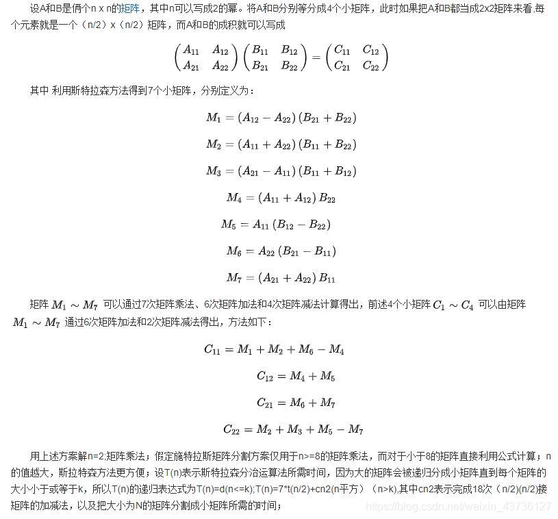

```c
/**
 * For stressen
 * Use SIMD and OpenMP
*/
Matrix *addMatrix(const Matrix *const a, const Matrix *const b) {
    size_t n = a->n;
    Matrix *ret = createMatrix(n, NULL);
    size_t siz = n*n;
    #pragma omp parallel for
    for (size_t i = 0; i < siz; i += 8)
        _mm256_store_ps(ret->entry+i, _mm256_add_ps(_mm256_load_ps(a->entry+i),
                                                    _mm256_load_ps(b->entry+i)));
    return ret;
}

/**
 * For stressen
 * Use SIMD and OpenMP
*/
Matrix *subMatrix(const Matrix *const a, const Matrix *const b) {
    size_t n = a->n;
    Matrix *ret = createMatrix(n, NULL);
    size_t siz = n*n;
    #pragma omp parallel for
    for (size_t i = 0; i < siz; i += 8)
        _mm256_store_ps(ret->entry+i, _mm256_sub_ps(_mm256_load_ps(a->entry+i),
                                                    _mm256_load_ps(b->entry+i)));
    return ret;
}

/**
 * For stressen
 * Use SIMD and OpenMP
*/
Matrix **divide_matrix(const Matrix *const mat) {
    size_t N = mat->n, n = mat->n>>1;
    Matrix **ret = malloc(sizeof(Matrix *)*4);

    #pragma omp parallel for
    for (size_t i = 0; i < 4; ++i) ret[i] = createMatrix(n, NULL);
    
    #pragma omp parallel for
    for (size_t i = 0; i < n; ++i)
        memcpy(ret[0]->entry+i*n, mat->entry+i*N, sizeof(float)*n);
    #pragma omp parallel for
    for (size_t i = 0; i < n; ++i)
        memcpy(ret[1]->entry+i*n, mat->entry+i*N+n, sizeof(float)*n);
    #pragma omp parallel for
    for (size_t i = 0; i < n; ++i)
        memcpy(ret[2]->entry+i*n, mat->entry+(n+i)*N, sizeof(float)*n);
    #pragma omp parallel for
    for (size_t i = 0; i < n; ++i)
        memcpy(ret[3]->entry+i*n, mat->entry+(n+i)*N+n, sizeof(float)*n);
    
    return ret;
}

/**
 * For stressen
 * Use SIMD and OpenMP
*/
Matrix *merge_matrix(Matrix **mat) {
    size_t n = mat[0]->n, N = mat[0]->n<<1;
    Matrix *ret = createMatrix(N, NULL);

    #pragma omp parallel for
    for (size_t i = 0; i < n; ++i)
        memcpy(ret->entry+i*N, mat[0]->entry+i*n, sizeof(float)*n);
    #pragma omp parallel for
    for (size_t i = 0; i < n; ++i)
        memcpy(ret->entry+i*N+n, mat[1]->entry+i*n, sizeof(float)*n);
    #pragma omp parallel for
    for (size_t i = 0; i < n; ++i)
        memcpy(ret->entry+(n+i)*N, mat[2]->entry+i*n, sizeof(float)*n);
    #pragma omp parallel for
    for (size_t i = 0; i < n; ++i)
        memcpy(ret->entry+(n+i)*N+n, mat[3]->entry+i*n, sizeof(float)*n);

    return ret;
}

/**
 * Reccursively divide and solve the multiplication
 * Use OpenMP
*/
Matrix *stressen(const Matrix *const a, const Matrix *const b) {
    size_t n = a->n;
    if (n <= 64)
        return mul_order_avx_omp(a, b);
    
    Matrix *ret, *mat[7], *c[4],
           **sub_a = divide_matrix(a),
           **sub_b = divide_matrix(b);
    #pragma omp parallel sections
    {
        #pragma omp section
        {
            Matrix *t[2];
            t[0] = subMatrix(sub_a[1], sub_a[3]);
            t[1] = addMatrix(sub_b[2], sub_b[3]);
            mat[0] = stressen(t[0], t[1]);
            deleteMatrix(t[0]);
            deleteMatrix(t[1]);
        }
        #pragma omp section
        {
            Matrix *t[2];
            t[0] = addMatrix(sub_a[0], sub_a[3]);
            t[1] = addMatrix(sub_b[0], sub_b[3]);
            mat[1] = stressen(t[0], t[1]);
            deleteMatrix(t[0]);
            deleteMatrix(t[1]);
        }
        #pragma omp section
        {
            Matrix *t[2];
            t[0] = subMatrix(sub_a[2], sub_a[0]);
            t[1] = addMatrix(sub_b[0], sub_b[1]);
            mat[2] = stressen(t[0], t[1]);
            deleteMatrix(t[0]);
            deleteMatrix(t[1]);
        }
        #pragma omp section
        {
            Matrix *temp;
            temp = addMatrix(sub_a[0], sub_a[1]);
            mat[3] = stressen(temp, sub_b[3]);
            deleteMatrix(temp);
        }
        #pragma omp section
        {
            Matrix *temp;
            temp = subMatrix(sub_b[1], sub_b[3]);
            mat[4] = stressen(temp, sub_a[0]);
            deleteMatrix(temp);
        }
        #pragma omp section
        {
            Matrix *temp;
            temp = subMatrix(sub_b[2], sub_b[0]);
            mat[5] = stressen(temp, sub_a[3]);
            deleteMatrix(temp);
        }
        #pragma omp section
        {
            Matrix *temp;
            temp = addMatrix(sub_a[2], sub_a[3]);
            mat[6] = stressen(temp, sub_b[0]);
            deleteMatrix(temp);
        }
    }

    #pragma omp parallel sections
    {
        #pragma omp section
        {
            Matrix *t[2];
            t[0] = addMatrix(mat[0], mat[1]);
            t[1] = subMatrix(mat[5], mat[3]);
            c[0] = addMatrix(t[0], t[1]);
            deleteMatrix(t[0]);
            deleteMatrix(t[1]);
        }
        #pragma omp section
        {
            c[1] = addMatrix(mat[3], mat[4]);
        }
        #pragma omp section
        {
            c[2] = addMatrix(mat[5], mat[6]);
        }
        #pragma omp section
        {
            Matrix *t[2];
            t[0] = addMatrix(mat[1], mat[2]);
            t[1] = subMatrix(mat[4], mat[6]);
            c[3] = addMatrix(t[0], t[1]);
            deleteMatrix(t[0]);
            deleteMatrix(t[1]);
        }
    }

    #pragma omp parallel for
    for (size_t i = 0; i < 4; ++i) {
        deleteMatrix(sub_a[i]);
        deleteMatrix(sub_b[i]);
    }
    free(sub_a);
    free(sub_b);

    ret = merge_matrix(c);
    #pragma omp parallel for
    for(size_t i = 0; i < 4; ++i)
        deleteMatrix(c[i]);
    
    return ret;
}
```


## Part 2 - Results & Verification

### 16*16

 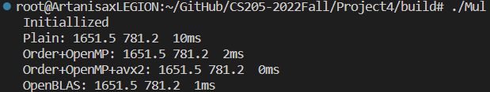

### 128*128

 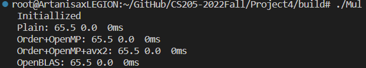

### 1024*1024

 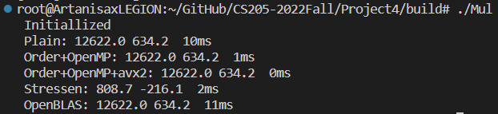

### 2048*2048

 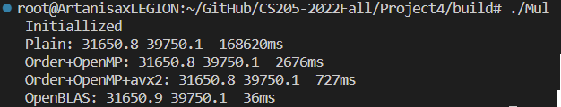

### 4096*4096

 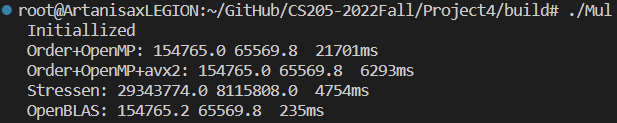

### 4096*4096 O3

 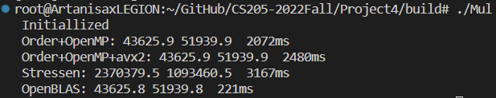

### 8192*8192 O3

 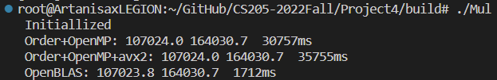

### 16384*16384 O3

 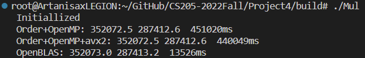

With `-O3`, avx2 seems useless. And OpenBLAS  run much faster than my implementations. 

### A Fun Discovery

AVX2 is more precise than normal arithmetic operation with `float`.

```c
size_t t = 1000000, 10000000, 100000000;
    float ans = 0;
    float *temp = (float *)aligned_alloc(256, sizeof(float)*8);
    for (int i = 0; i < 8; ++i) temp[i] = i;
    gettimeofday(&st, NULL);
    for (int i = 0; i < t; ++i)
        for (int j = 0; j < 8; j++)
            ans += temp[j];
    gettimeofday(&ed, NULL);
    printf(" %.1f %.0fms\n", ans, 1.0*((ed.tv_sec-st.tv_sec)*1e6+(ed.tv_usec-st.tv_usec))/1e3);
    gettimeofday(&st, NULL);
    float sum[8];
    __m256 a = _mm256_setzero_ps(), b;
    for (int i = 0; i < t; ++i) {
        b = _mm256_load_ps(temp);
        a = _mm256_add_ps(a, b);
    }
    a = _mm256_hadd_ps(a, a);
    a = _mm256_hadd_ps(a, a);
    _mm256_store_ps(sum, a);
    putchar('\n');
    ans = sum[0]+sum[4];
    gettimeofday(&ed, NULL);
    printf(" %.1f %.0fms\n", ans, 1.0*((ed.tv_sec-st.tv_sec)*1e6+(ed.tv_usec-st.tv_usec))/1e3);
```

 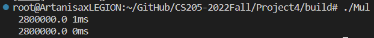

 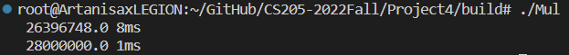

 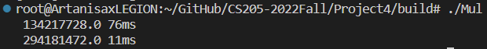


## Part 3 - Self-review

Though my result is far far away from OpenBLAS, and even $$\Theta(n^3)$$ with optimizing can beat algorithm with $$\Theta(n^{2.7})$$ . This project tells me our computer (both software and hardware) has much more potential to be squeezed and some times simple optimization can win better algorithm with bigger constants in reality, which only need limited data size. The depressing results dose encourage me to learn more about principles of computer composition and compilation of software.


## Part 4 - Codes & Comments

Please see [My GitHub Repository](https://github.com/Artanisax/CS205-2022Fall/tree/main/Project4)

