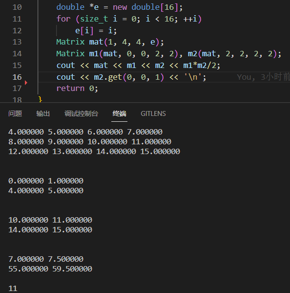
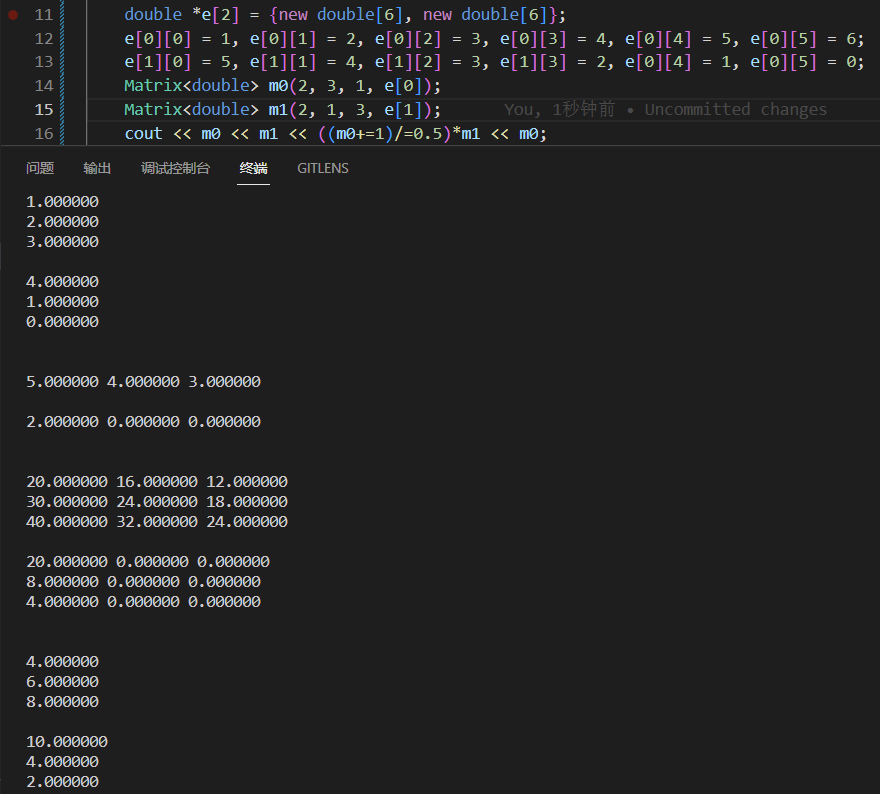
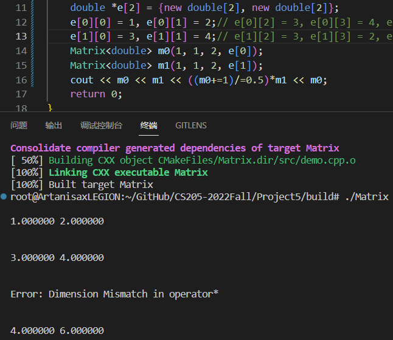
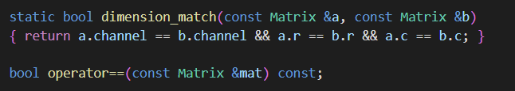
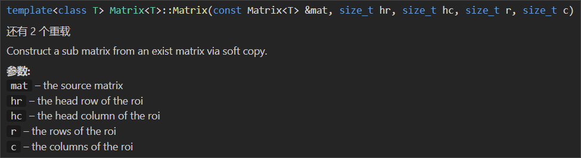

[toc]

# CS205-2022Fall Project 5

## A Class for Matrices

**Name:** 陈康睿

**SID:** 12110524


## Part 1 - Analysis & Implementation

This project requires us to use `C++` and design a class for matrix operations, which contains more attributes, for example, channels.  Also, this class should support different data types especially primitive ones such as integer types and float types with different precision. Further more, it ask as to implement soft copy with ROI just like how `OpenCV` dose. So I chose to use template class to support multiple data types, and a one dimentional array to store entries, via using `std::shared_ptr` to manage pointers and to avoid memory leaking. 


### Include, Namespace & Pragma

```c++
// Matrix.cpp
#pragma once
// #pragma omp parallel for

#include <cstddef>
#include <memory>
#include <string>
#include <cstring>
#include <iostream>
// #include <omp.h>

using std::shared_ptr;
using std::default_delete;
using std::string;
using std::ostream;
using std::cout;
using std::cerr;
using std::endl;
```


### Class Attributes

The significance of the attributes are in the annotations. It is worth a mention that `shared_ptr` destruct it's content by calling `std::default_deleter<T>()` , however, we want to manage pointer of array here. So latter we need to costomize its deleter with `default_deleter<T[]>()`.

```c++
class Matrix
{
private:
	size_t channel = 0, row = 0, col = 0;  // Three dimensions of the original matrix
	size_t roi = 0;                        // The starting index of the the region of interest
	size_t r = 0, c = 0;                   // Two dimensions of the interesting matrix
	shared_ptr<T> entry;                   // A shared pointer managing the original data
public:
	...
}
```


### Functions

#### Basic

##### Constructor

I designed 3 constructors for this class according to their usages. Noted that theree is no need to implement another copy constructor because by using shared_ptr, defualt copy constructor can achieve soft copy implicitly.

```c++
Matrix();
Matrix(const size_t channel, const size_t row, const size_t col, const T *data);
Matrix(const Matrix &mat, size_t hr, size_t hc, size_t r, size_t c);
// Matrix(const Matrix &mat);
```

The parameter-free default constructor is to create a Matrix with its all attributes equals to $0$ or empty containers, usually used in exception handling.

```c++
template <typename T>
Matrix<T>::Matrix(): entry(new T[0], default_delete<T[]>()) {}
```

The second constructor is to create a Matrix with given data(or nullptr), with its ROI is the whole matrix.

```c++
/**
 * @brief Construct a matrix with interest on its whole region.
 * @param channel the number of channels
 * @param row the number of rows
 * @param col the number of columns
 * @param data the pointer pointing to the original data
*/
template <typename T>
Matrix<T>::Matrix(const size_t channel, const size_t row, const size_t col, const T *data):
	channel(channel), row(row), col(col), entry(new T[channel*row*col], default_delete<T[]>()),
	r(row), c(col)
{ if (data)  memcpy(entry.get(), data, channel*row*col*sizeof(T)); }
```

The third one is to create a sub matrix from an existing matrix via soft copy. It use given parameters that indicates the head of interesting region to calculate the offset between ROI and the starting address of the whole matrix in each channel.

```c++
/**
 * @brief Construct a sub matrix from an exist matrix via soft copy.
 * @param mat the source matrix
 * @param hr the head row of the roi
 * @param hc the head column of the roi
 * @param r the rows of the roi
 * @param c the columns of the roi
*/
template <typename T>
Matrix<T>::Matrix(const Matrix<T> &mat, size_t hr, size_t hc, size_t r, size_t c):
	channel(mat.channel), row(mat.row), col(mat.col), entry(mat.entry),
	r(r), c(c), roi(mat.roi+hr*col+hc)
{
	if (roi/col+r > row || roi%col+c > col)
	{
		cerr << "Error: Out of Range in " << __func__ << endl;
		*this = Matrix<T>();
	}
}
```

##### uniquify

This function is used in some arithmetic operations which require new instances as results but leave the original ones remain the same. It firstly check where it's entry is unique, if not, it use hard copy to refactor the original one to a new independent Matrix.

```c++
// Use hard copy to refactor a unique Matrix with the same content.
// If its entry pointer is not shared, then this will do nothing.
template <typename T>
void Matrix<T>::uniquify()
{
	if (entry.unique())  return; 
	Matrix<T> res(channel, r, c, nullptr);
	T *dest = res.entry.get(), *src = entry.get();
	for (size_t k = 0, len = c*sizeof(T); k < channel; ++k)
	for (size_t i = 0, krc = k*r*c, krcr = k*row*col+roi; i < r; ++i)
		memcpy(dest+krc+i*c, src+krcr+i*col, len);
	*this = res;
}
```

##### getter & setter

Basic stuff, not much to say.

```c++
/**
 * @brief Get the value about corresponding indexes.
 * @param k channel
 * @param i row
 * @param j column
*/
template <typename T>
T Matrix<T>::get(const size_t k, const size_t i, const size_t j) const
{
	if (k >= channel || i >= r || j >= c)
	{
		cerr << "Error: Out of Range in " << __func__ << endl;
		return 0;
	}
	return entry.get()[k*row*col+roi+i*col+j];
}

/**
 * @brief Set a value about corresponding indexes.
 * @param k channel
 * @param i row
 * @param j column
*/
template <typename T>
T Matrix<T>::set(const size_t k, const size_t i, const size_t j, const T x)
{
	if (k >= channel || i >= r || j >= c)
	{ cerr << "Error: Out of Range in " << __func__ << endl; }
	entry.get()[k*row*col+roi+i*col+j] = x;
}
```

##### visualization

Cast the matrix into string for output or other usages.

```c++
// Covert Matrix into string.
template <typename T>
string Matrix<T>::to_string() const
{
    string s("\n");
    T *p = entry.get();
    for (size_t k = 0, area = row*col; k < channel; ++k)
    {
        for (size_t i = 0, head_i = k*area+roi; i < r; ++i)
        {
            for (size_t j = 0, head_j = head_i+i*col; j < c; ++j)
                s += std::to_string(p[head_j+j])+" ";
            s += "\n";
        }
        s += "\n";
    }
    return s;
}

void print() const { cout << to_string(); }
```

##### match

This static function is to check whether the dimensions of two matrices are the same and then help judge the validity of their arithmetic operations.

```c++
static bool dimension_match(const Matrix &a, const Matrix &b)
{ return a.channel == b.channel && a.r == b.r && a.c == b.c; }
```


#### Arithmetic

##### Matrix

Process are quite similar in these operator overridings: Check whether the two matrices can calculate by this operator, if so, calculate them using their ROI, which is full of details and require careful coding. I tried to reduce repeated calculation by local variables for acceleration, and also mind the order of loops in multiplication.

```c++
template <typename T>
bool Matrix<T>::operator==(const Matrix<T> &mat) const
{
	if (!dimension_match(*this, mat))  return false;
	T *p[2] = {entry.get(), mat.entry.get()};
	if (p[0] == p[1] && roi == mat.roi)  return true;
	for (size_t k = 0, area[2] = {row*col, mat.row*mat.col}; k < channel; ++k)
	for (size_t i = 0, head_i[2] = {k*area[0]+roi, k*area[1]+mat.roi}; i < r; ++i)
	for (size_t j = 0, head_j[2] = {head_i[0]+i*col, head_i[1]+i*mat.col}; j < c; ++j)
		if (p[0][head_j[0]+j] != p[1][head_j[1]+j])  return false;
	return true;
}

template <typename T>
Matrix<T> Matrix<T>::operator+(const Matrix<T> &mat) const
{
	if (!dimension_match(*this, mat))
	{
		cerr << "\nError: Dimension Mismatch in " << __func__ << endl;
		return Matrix();
	}
	Matrix<T> res(*this);
	res.uniquify();
	T *dest = res.entry.get(), *src = mat.entry.get();
	for (size_t k = 0, area[2] = {mat.row*mat.col, r*c}; k < channel; ++k)
	for (size_t i = 0, head_i[2] = {k*area[0]+mat.roi, k*area[1]}; i < r; ++i)
	for (size_t j = 0, head_j[2] = {head_i[0]+i*mat.col, head_i[1]+i*c}; j < c; ++j)
		dest[head_j[1]+j] += src[head_j[0]+j];
	return res;
}

template <typename T>
Matrix<T> Matrix<T>::operator-(const Matrix<T> &mat) const
{
	if (!dimension_match(*this, mat))
	{
		cerr << "\nError: Dimension Mismatch in " << __func__ << endl;
		return Matrix();
	}
	Matrix<T> res(*this);
	res.uniquify();
	T *dest = res.entry.get(), *src = mat.entry.get();
	for (size_t k = 0, area[2] = {mat.row*mat.col, r*c}; k < channel; ++k)
	for (size_t i = 0, head_i[2] = {k*area[0]+mat.roi, k*area[1]}; i < r; ++i)
	for (size_t j = 0, head_j[2] = {head_i[0]+i*mat.col, head_i[1]+i*c}; j < c; ++j)
		dest[head_j[1]+j] -= src[head_j[0]+j];
	return res;
}

template <typename T>
Matrix<T> Matrix<T>::operator*(const Matrix<T> &mat) const
{
	if (channel != mat.channel|| c != mat.r)
	{
		cerr << "\nError: Dimension Mismatch in " << __func__ << endl;
		return Matrix();
	}
	Matrix<T> res(channel, r, mat.c, nullptr);
	T *dest = res.entry.get(), *src[2] = {entry.get(), mat.entry.get()};
	bzero(dest, channel*res.row*res.col*sizeof(T));
	for (size_t t = 0, area[3] = {row*col, mat.row*mat.col, res.row*res.col}; t < channel; ++t)
	for (size_t i = 0, head_i[3] = {t*area[0]+roi, t*area[1]+mat.roi, t*area[2]}; i < r; ++i)
	for (size_t k = 0, head0 = head_i[0]+i*col, head2 = head_i[2]+i*res.col; k < c; ++k)
	for (size_t j = 0, head1 = head_i[1]+k*mat.col, src0 = src[0][head0+k]; j < mat.c; ++j)
		dest[head2+j] += src0*src[1][head1+j];
	return res;
}

template <typename T>
Matrix<T> &Matrix<T>::operator+=(const Matrix<T> &mat)
{
	if (!dimension_match(*this, mat))
	{
		cerr << "\nError: Dimension Mismatch in " << __func__ << endl;
		return *this = Matrix<T>();
	}
	uniquify();
	T *dest = entry.get(), *src = mat.entry.get();
	for (size_t k = 0, area[2] = {mat.row*mat.col, row*col}; k < channel; ++k)
	for (size_t i = 0, head_i[2] = {k*area[0]+mat.roi, k*area[1]+roi}; i < r; ++i)
	for (size_t j = 0, head_j[2] = {head_i[0]+i*mat.col, head_i[1]+i*col}; j < c; ++j)
		dest[head_j[1]+j] += src[head_j[0]+j];
	return *this;
}

template <typename T>
Matrix<T> &Matrix<T>::operator-=(const Matrix<T> &mat)
{
	if (!dimension_match(*this, mat))
	{
		cerr << "\nError: Dimension Mismatch in " << __func__ << endl;
		return *this = Matrix<T>();
	}
	uniquify();
	T *dest = entry.get(), *src = mat.entry.get();
	for (size_t k = 0, area[2] = {mat.row*mat.col, row*col}; k < channel; ++k)
	for (size_t i = 0, head_i[2] = {k*area[0]+mat.roi, k*area[1]+roi}; i < r; ++i)
	for (size_t j = 0, head_j[2] = {head_i[0]+i*mat.col, head_i[1]+i*col}; j < c; ++j)
		dest[head_j[1]+j] -= src[head_j[0]+j];
	return *this;
}

template <typename T>
Matrix<T> &Matrix<T>::operator*=(const Matrix<T> &mat)
{
	if (channel != mat.channel|| c != mat.r)
	{
		cerr << "\nError: Dimension Mismatch in " << __func__ << endl;
		return *this = Matrix<T>();
	}
	return this = (*this)*mat;
}
```

##### Scale

Much simpler than those between matrices.

```c++
template <typename T>
Matrix<T> Matrix<T>::operator+(const T x) const
{
	Matrix<T> res(*this);
	res.uniquify();
	T *p = res.entry.get();
	for (size_t i = 0, siz = channel*r*c; i < siz; ++i)
		p[i] += x;
	return res;
}

template <typename T>
Matrix<T> Matrix<T>::operator-(const T x) const
{
	Matrix<T> res(*this);
	res.uniquify();
	T *p = res.entry.get();
	for (size_t i = 0, siz = channel*r*c; i < siz; ++i)
		p[i] -= x;
	return res;
}

template <typename T>
Matrix<T> Matrix<T>::operator*(const T x) const
{
	Matrix<T> res(*this);
	res.uniquify();
	T *p = res.entry.get();
	for (size_t i = 0, siz = channel*r*c; i < siz; ++i)
		p[i] *= x;
	return res;
}

template <typename T>
Matrix<T> Matrix<T>::operator/(const T x) const
{
    if (x == 0)
	{
		cerr << "Error: Divide by 0 in " << __func__ << endl;
		return Matrix<T>();
	}
	Matrix<T> res(*this);
	res.uniquify();
	T *p = res.entry.get();
	for (size_t i = 0, siz = channel*r*c; i < siz; ++i)
		p[i] /= x;
	return res;
}

template <typename T>
Matrix<T> &Matrix<T>::operator=(const T x)
{
	uniquify();
	T *p = entry.get();
	for (size_t k = 0, area = row*col; k < channel; ++k)
	for (size_t i = 0, head_i = k*area+roi; i < r; ++i)
	for (size_t j = 0, head_j = head_i+i*col; j < c; ++j)
		p[head_j+j] = x;
	return *this;
}

template <typename T>
Matrix<T> &Matrix<T>::operator+=(const T x)
{
	uniquify();
	T *p = entry.get();
	for (size_t k = 0, area = row*col; k < channel; ++k)
	for (size_t i = 0, head_i = k*area+roi; i < r; ++i)
	for (size_t j = 0, head_j = head_i+i*col; j < c; ++j)
		p[head_j+j] += x;
	return *this;
}

template <typename T>
Matrix<T> &Matrix<T>::operator-=(const T x)
{
	uniquify();
	T *p = entry.get();
	for (size_t k = 0, area = row*col; k < channel; ++k)
	for (size_t i = 0, head_i = k*area+roi; i < r; ++i)
	for (size_t j = 0, head_j = head_i+i*col; j < c; ++j)
		p[head_j+j] -= x;
	return *this;
}

template <typename T>
Matrix<T> &Matrix<T>::operator*=(const T x)
{
	uniquify();
	T *p = entry.get();
	for (size_t k = 0, area = row*col; k < channel; ++k)
	for (size_t i = 0, head_i = k*area+roi; i < r; ++i)
	for (size_t j = 0, head_j = head_i+i*col; j < c; ++j)
		p[head_j+j] *= x;
	return *this;
}

template <typename T>
Matrix<T> &Matrix<T>::operator/=(const T x)
{
	if (x == 0)
	{
		cerr << "Error: Divide by 0 in " << __func__ << endl;
		return *this = Matrix<T>();
	}
	uniquify();
	T *p = entry.get();
	for (size_t k = 0, area = row*col; k < channel; ++k)
	for (size_t i = 0, head_i = k*area+roi; i < r; ++i)
	for (size_t j = 0, head_j = head_i+i*col; j < c; ++j)
		p[head_j+j] /= x;
	return *this;
}
```


#### Acceleration

##### OpenMP

Noted that there many loops in those functions, and we can used multi-threat technique to accelerate the calculation. And in practice , we won't use to many channels (usually less than or equal to 3, RBG for example). So it's wiser to put `#pragma omp parallel for` in front of row or column loops other than channel loops. (See more detail in Part 3)

##### Intrinsics

As this class is mainly aimed to support primitive data types, we can specialize template functions to use intrinsic functions to accel the calculation. Nevertheless, it's a huge workload so I didn't implement them in this project.


### Exception Handling

For these operations don't have complex combinations and nestings, and we can't expect users to handle the exceptions we throw. So I choose to just check validity seperately in each function and tell users what's wrong in error stream. Then return an empty matrix.


## Part 2 - Results & Verification

### Demonstration

#### ROI



#### Channels



#### Exception




### User-friendly Coding

1. I've used `const` to modify function parameters, so users will know whether the matrix itself or the parameters are changed in different functions.

   

2. I've used annotations `@` in comments to elaborate functions and parameters, soo users can catch the purposes of the functions and  meanings of variables and parameters. Some annotations brief on how corresponding functions work to recommend users choose more suitable interfaces.

   

   

## Part 3 - Self-review

1. In this project I found poor code style had made it much harder for me to make adjustments on some blocks. For instance, I used to define local varible in loop conditions to save braces:

   ```c++
   for (size_t k = 0, area = row*col; k < channel; ++k)
   for(..., ...; ...; ...)
   ...
   ```

   However, when I tried to use OpenMP, it got confused by my loop conditions, so if I want to use OpenMP optimization to cover the whole of my project, it would take a lot time to move these definitions out like:

   ```c++
   size_t area = row*col
   for (size_t k = 0; k < channel; ++k)
   {
   	size_t ...;
   	for (...; ...; ...)
       {...}
   }
   ```

   This process is quite boring and mistakable. So, though I've made some progress during this semester, in further coding I will go on proving my code style to make it more readable and maintainable。

 2. Although function declarations and definations of template class can't be seperated to different files to compile for instantiation problem (i.e. each file is an independent compile moldule). It still have some tricks to seperate them for human but not for the compiler and make code more organized. That is to put implementations in another file with costomized file extensions (except `.cpp` by convention, `.ipp` is a popular choice):

    ```c++
    template <...>
    class ...
    {
        ...(declarations)
    }
    
    #include <definations.ipp>
    ```

3. Above all, my design and implementation was somewhat immature. But now I have little idea about how to improve it, both functionally and efficiently. There is still a long way to go, more source code to read, more communication to have, more knowledge to learn, more insight to gain......


## Part 4 - Codes & Comments

Available on [My GitHub Repository](https://github.com/Artanisax/CS205-2022Fall/tree/main/Project5) 
